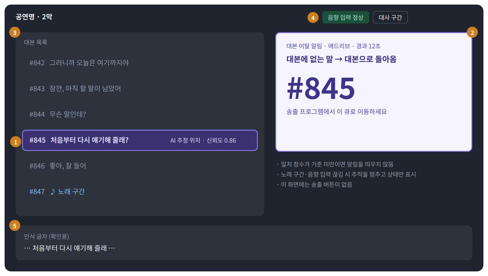
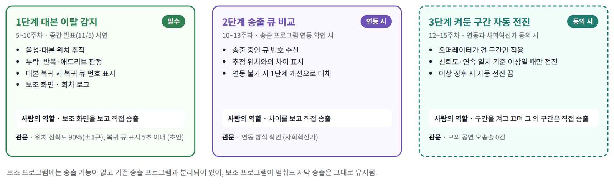
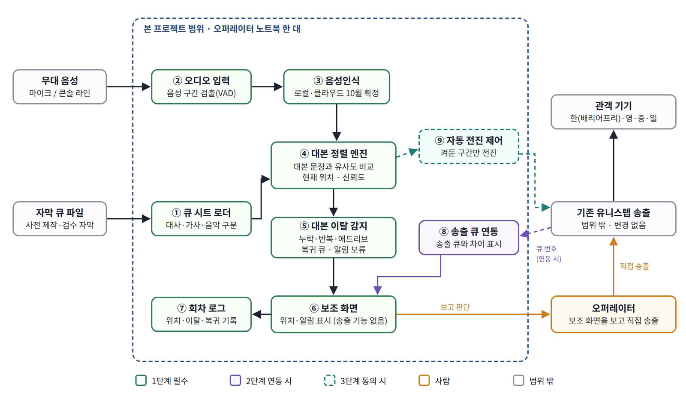

<div align="center">

# Helper

**음성인식 기반 공연 자막 오퍼레이터 작업 보조 인터페이스**

배우가 대본을 벗어났다 돌아오면, 돌아온 자막 큐 번호를 오퍼레이터에게 바로 알려 줍니다.

[수행계획서](Doc/1_1_OSSProj_03_Helper_수행계획서.pdf) · [발표자료](Doc/1_2_OSSProj_03_Helper_수행계획발표자료.pptx) · [회의록](Doc/4_1_OSSProj_03_Helper_회의록.pdf)



<sub>공연 중 오퍼레이터가 보는 보조 화면 (와이어프레임)</sub>

</div>

| 항목 | 내용 |
|---|---|
| 과목 | 동국대학교 오픈소스소프트웨어프로젝트 (2026-2학기) |
| 팀 | 03팀 Helper |
| 사회혁신가 | ㈜오롯플래닛 (공연 자막 서비스 '유니스텝') |
| 기간 | 2026.9 \~ 2026.12 |

## 왜 만드나요

유니스텝 오퍼레이터는 한 공연에 1,000개가 넘는 자막 큐를 손으로 한 줄씩 넘깁니다.

- 배우가 애드리브를 하거나 대사를 건너뛰면 대본 위치를 놓치기 쉽습니다.
- 위치를 다시 찾는 동안 자막이 비거나 늦어지고, 길면 30초까지 늦어집니다.
- 공연과 캐스트가 3\~4개월마다 바뀌어서 새로 들어온 오퍼레이터가 같은 어려움을 반복합니다.
- 음성인식 결과를 그대로 자막으로 내보내면 틀린 글자가 관객에게 보여서 현장에서는 쓰지 않습니다.

그래서 Helper는 음성인식 결과를 관객에게 보여 주지 않고, **대본에서 현재 위치를 찾는 데만** 씁니다. 송출은 지금처럼 오퍼레이터가 직접 합니다.

| 구분 | 지금 | Helper 사용 시 |
|---|---|---|
| 자막 송출 | 오퍼레이터가 수동 송출 | 변경 없음 |
| 현재 대본 위치 | 오퍼레이터의 기억에 의존 | 보조 화면에 추정 위치 표시 |
| 애드리브·대사 누락 | 위치를 놓치면 빈 자막 | 이탈 알림 후 복귀 큐 번호 표시 |
| 기록 | 없음 | 회차별 이탈·복귀 로그 |

## 주요 기능

<p align="center"></p>

- **1단계 (이번 학기 필수):** 대본 위치 추적, 대본 이탈 감지(누락·반복·애드리브), 복귀 큐 표시
- **2단계 (송출 프로그램 연동이 될 때):** 송출 중인 큐와 추정 위치의 차이 표시
- **3단계 (연동 + 사회혁신가 동의 시):** 오퍼레이터가 켠 구간만 다음 큐로 자동 전진

## 시스템 구성

오퍼레이터 노트북 한 대에서 동작합니다. 로컬 서버(FastAPI)가 음성인식과 대본 정렬을 처리하고, 보조 화면(React)에 WebSocket으로 결과를 보냅니다.

<p align="center"></p>

| 영역 | 기술 |
|---|---|
| 음성 처리 | Python 3.11, silero-vad |
| 음성인식 | faster-whisper / 클라우드 STT (10월 비교 후 결정) |
| 대본 정렬 | 문자열 유사도, 한글 자모 분해, 상태 기계 |
| 서버·화면 | FastAPI, WebSocket, React, TypeScript |
| 데이터·배포 | SQLite, PyInstaller, GitHub Releases |

## 목표

| 지표 | 목표 |
|---|---|
| 위치 추적 정확도 | 90% 이상 (앞뒤 1큐 허용) |
| 대본 복귀 후 복귀 큐 표시까지 | 5초 이내 (현장 최대 30초) |
| 사용성 | SUS 70점 이상, 10분 안내 후 사용 가능 |

수치는 10월 공연 참관에서 현재 상황을 측정한 뒤 사회혁신가와 함께 확정합니다.

## 일정

| 기간 | 내용 |
|---|---|
| 1\~4주 | 팀 구성, 필드트립 인터뷰(9/15), 문제 정의, 수행계획서 |
| 5주 (10/1) | 제안 발표 |
| 5\~10주 | 기술 검증, 1단계 개발 |
| 10주 (11/5) | 중간 발표, 1단계 시연 |
| 10\~14주 | 2·3단계 개발(연동·동의 시), 사용성 평가 |
| 15주 (12/10) | 성과 발표, 오픈소스 공개 |

## 저장소 구조

```
├── Src/       소스 코드 (1단계 개발부터 추가)
├── Doc/       수행계획서, 발표자료, 회의록, 보고서
└── images/    README에 쓰는 그림
```

공연 대본과 음원은 제작사 자산이라 저장소에 올리지 않습니다. 문서 목록은 [Doc/README.md](Doc/README.md)에 있습니다.

## 팀원

| 이름 | 역할 | 담당 |
|---|---|---|
| 김소영<br>[@ssoju-kim](https://github.com/ssoju-kim) | 팀장·기획 | 사회혁신가 소통, 일정 관리, 요구사항·성공 기준 설계, 큐 시트 로더, 회차 로그 |
| 강지호<br>[@Jiho0221](https://github.com/Jiho0221) | 개발 | 음성인식, 대본 정렬 엔진, 이탈 감지, 로컬 서버, 테스트·저장소 관리 |
| 이동은<br>[@leedongeun0328](https://github.com/leedongeun0328) | 디자인 | 보조·준비·설정 화면 UX/UI와 프론트엔드, 사용 안내 자료, 사용성 평가 |

지도교수: 이길섭 교수 (동국대학교 SW교육원)
